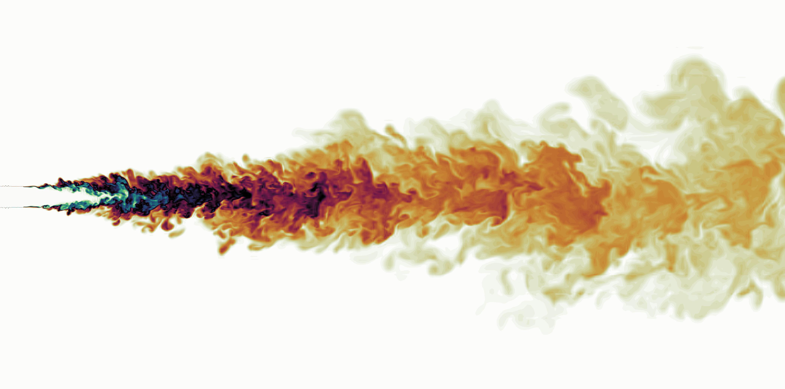

# Buoyant Jet and Desalination Discharges **More Content Coming Later**

<p>
  This repository contains research materials related to my <strong>PhD thesis on buoyant jets</strong>, with a specific focus on <strong>thermal and desalination discharges</strong> in coastal and shallow water environments.
  My research integrates <strong>high-fidelity numerical simulations</strong>—including <em>Direct Numerical Simulation (DNS)</em> and <em>Large Eddy Simulation (LES)</em> with experimental techniques such as <em>Laser-Induced Fluorescence (LIF)</em> and <em>Particle Image Velocimetry (PIV)</em> to investigate mixing, dilution, and turbulence structures in buoyant jets.
</p>

<p>
  The goal is to improve understanding and predictive capabilities for <strong>environmental discharge behavior</strong>,
  inform <strong>outfall design optimization</strong>, and support <strong>regulatory compliance</strong> in desalination and wastewater applications.
  The repository includes solvers, postprocessing codes, mesh generation scripts, and experimental datasets.
</p>

<p align="center">
  
  <br>
  <em>Figure: Scalar field of a jet.</em>
</p>

## **Contents**

The repository includes:

- [**Gmsh scripts**](https://github.com/HydroCFD/buoyant_jet/tree/main/Gmsh) for mesh generation compatible with both **OpenFOAM** and **Nek5000**
- A [**non-dimensional OpenFOAM solver**](https://github.com/HydroCFD/buoyant_jet/tree/main/OpenFOAM/Solver/pimpleDesalination) along with practical simulation examples
- **Nek5000 simulation cases** for thermal buoyant jet
- **Postprocessing codes** for both **OpenFOAM** and **Nek5000** results
- **Experimental datasets** and **Postprocessing codes** for **PIV** and **LIF** measurements

## **Contributors**

- **Danial Goodarzi**  
  _Ph.D. Researcher in Fluid Mechanics and Environmental Hydraulics_  
  Lead developer and main contributor to this repository.
  [ResearchGate](https://www.researchgate.net/profile/Danial-Goodarzi)

- **Prof. Majid Mohammadian**  
  _Professor, Department of Civil Engineering, University of Ottawa_  
  Academic supervisor and research advisor for this project.
  [University of Ottawa](https://by.genie.uottawa.ca/~majid/)

- **Collaborators**
  <!-- This project is conducted in collaboration with researchers at the University of Ottawa and the **National Research Council (NRC) Canada** -->

## **Cite Our Work**

If you use this repository or any part of it in your research, please cite the following related papers:

1. _Goodarzi, D. (2024). "Comment on 'Venturi nozzles for desalination brine discharges' [Amiri, N. S., Abessi, O., & Roberts, P. J., Desalination, 573 (2024), 117193]."_[https://doi.org/10.1016/j.desal.2024.118105](https://doi.org/10.1016/j.desal.2024.118105)

2. _Goodarzi, D., Mohammadian, A., Rezaeiravesh, S., (2025). Numerical simulation of desalination brine discharges: effects of inlet boundary conditions_, _Under review in Desalination_

You can also cite the repository directly:

```bibtex
@misc{buoyant_jet,
  author       = {Danial Goodarzi},
  title        = {Buoyant Jet: CFD and Experimental Resources for Thermal and Desalination Discharges},
  year         = {2025},
  url          = {https://github.com/HydroCFD/buoyant_jet},
  note         = {GitHub repository}
}
```
